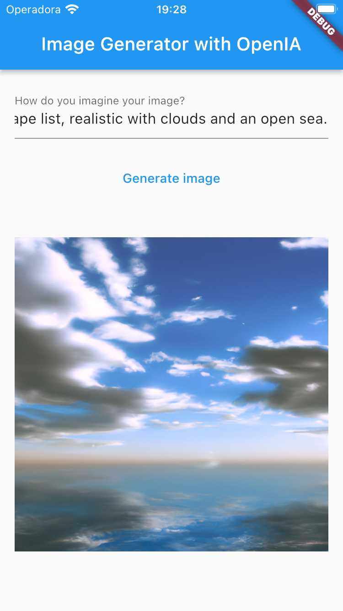

# Biblioteca para gerar imagens com base em input do usuário usando a API da OpenAI

Esta biblioteca permite que você gere imagens com base em um input de texto fornecido pelo usuário, utilizando a API da OpenAI. Além disso, o input é traduzido do português para o inglês com a biblioteca do Google Translate antes de ser enviado para a API.
Também é feito usando MVVM

## Como usar

Para utilizar esta biblioteca, basta instanciar a classe `IGViewModel` e chamar o método `generateImage(input)` passando o input desejado como parâmetro. Em seguida, basta ficar de olho nas propriedades `imageUrl`, `errorMessage` e `loading` para obter o resultado da operação.



Exemplo:
```
final viewModel = IGViewModel(IGRepositoryImpl(
  IGDataSourceImpl('SUA_API_KEY_AQUI'),
  GoogleTranslate.initialize(apiKey: "SUA_API_KEY_AQUI", targetLanguage: "en");,
));

await viewModel.generateImage('Goku fazendo a fusão com Yusuke Urameshi');

if (viewModel.loading) {
  print('Aguarde enquanto a imagem é gerada...');
} else if (viewModel.errorMessage != null) {
  print('Ocorreu um erro ao gerar a imagem: ${viewModel.errorMessage}');
} else {
  print('A imagem foi gerada com sucesso: ${viewModel.imageUrl}');
}
```
## Instalação
Para instalar esta biblioteca, adicione o seguinte código ao arquivo pubspec.yaml do seu projeto:

```
dependencies:
  open_ai:
```

E execute o comando flutter pub get no terminal para instalar as dependências.

## Dicas
Para gerar um padrão de pastas igual este, instale o seguinte plug-in no seu Android Studio ou IntelliJ IDEA:
[Clean-Architecture Plugin](https://github.com/Tyxz/clean_architecture_plugin)
* Android Studio / IntelliJ IDEA -> Plugins -> Browse repositories
* Search: Clean Architecture for Flutter
* Install
* Restart IDE

## Licença MIT
Este projeto está licenciado sob a licença MIT.

## Artigo falando sobre Clean Architecture e MVVM no Flutter:
[Megamil](https://megamil.com.br/2023/01/02/clean-architecture-em-flutter/)
[Linkdin](https://www.linkedin.com/in/eduardodsantos/)